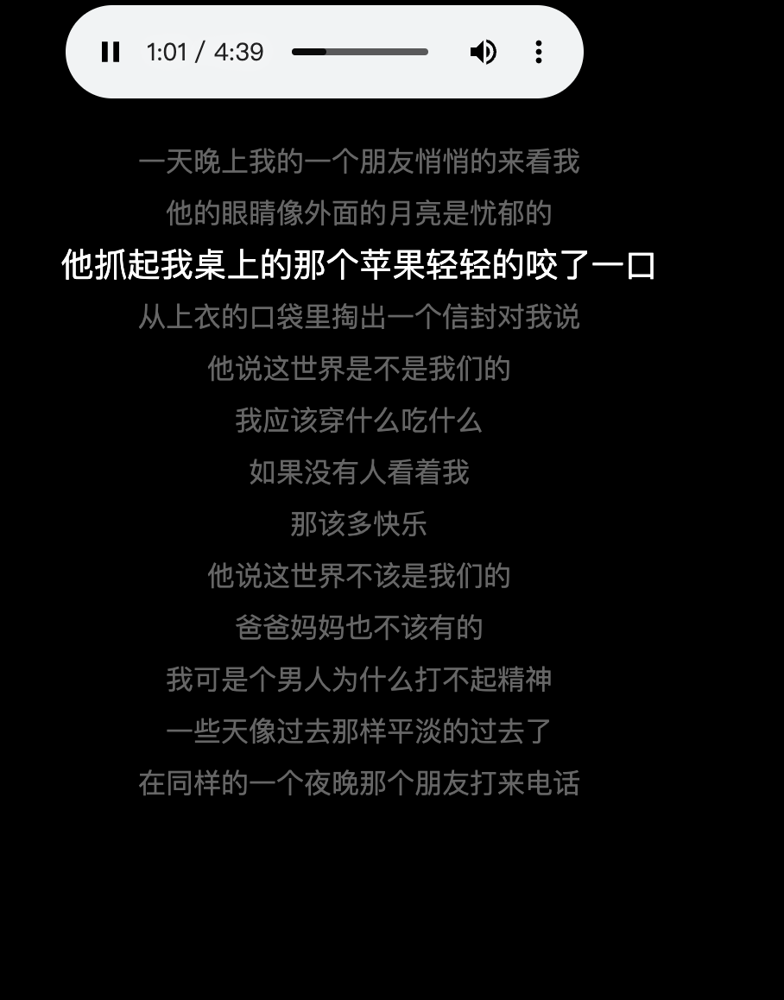

# MusicPlay
 javascript 原生实现一个简单的播放器Demo

 Javascript natively implements a simple player Demo

 歌词跟歌曲不匹配，找不到带时间轴的离婚歌词。代码逻辑是对的。
 
The lyrics don't match the song, and I can't find divorce lyrics with a timeline. The code logic is correct.

>preview

